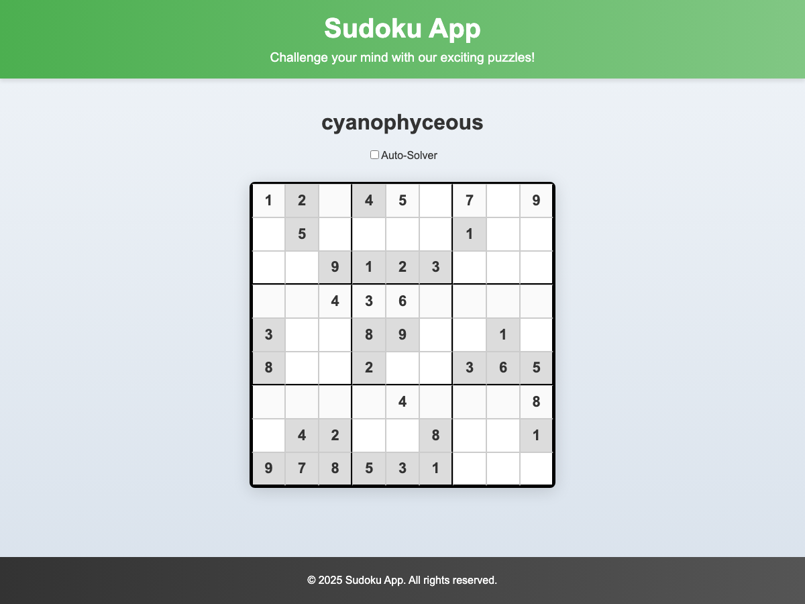
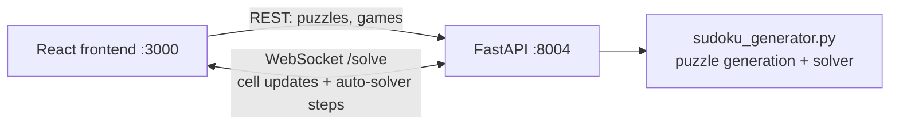

# Sudoku App


**Full-stack Sudoku: React + FastAPI + WebSockets.** Pick a puzzle, solve it live, or flip on the auto-solver and watch it fill the board step by step over a WebSocket stream.



## How it works



- **Backend** owns the game state; every move is validated server-side
- **Auto-solver** streams its steps over the WebSocket — the board animates as it solves
- Puzzle names are random words from `random-word` (yes, "cyanophyceous" is a real puzzle)

## Run it

```bash
# backend
cd backend && uv venv && uv pip install fastapi "uvicorn[standard]" pydantic random-word
uvicorn main:app --port 8004

# frontend
cd frontend && npm install && npm start   # opens :3000
```

## Structure

```
backend/
  main.py               # FastAPI: REST + WebSocket endpoints
  sudoku_generator.py   # board generation and solving
frontend/src/
  components/           # PuzzleList, GameList, PuzzleSolver
```

## License

MIT
